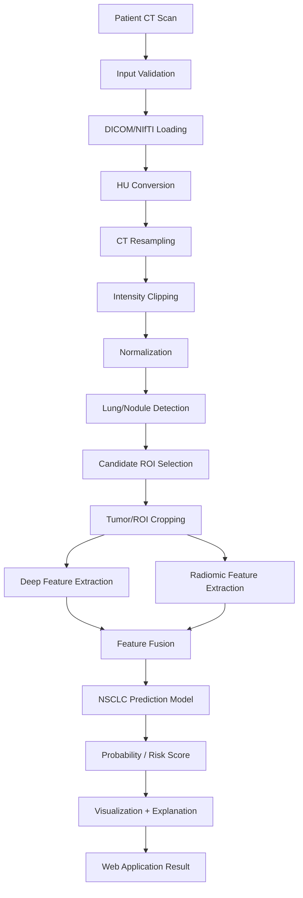

# AI Lung CT Analysis

**Research Prototype for NSCLC CT Analysis**

> ⚠️ **This application is a research and educational prototype and is NOT a
> medical diagnostic device.** Predictions are generated by an artificial
> intelligence model and must not be used as a substitute for evaluation by
> a qualified radiologist or physician. Performance on external patients may
> differ from performance on research datasets.

---

## Overview

AI Lung CT Analysis is an open, GitHub-ready research prototype that
demonstrates how a pretrained medical-imaging model can be combined with
radiomic and deep-learning features to analyze lung CT scans for
**NSCLC-related** patterns. It provides a full Streamlit dashboard, a
patient-privacy-conscious preprocessing pipeline, an explainability layer
(Grad-CAM), and a modular training pipeline for researchers who want to
fine-tune a classifier on their own data.

## Research Objective

To demonstrate an end-to-end pipeline — from raw CT (DICOM/NIfTI) through
preprocessing, pretrained-model-based nodule localization, radiomic/deep
feature extraction, and an optional project-specific classifier — for
**NSCLC** analysis, while being explicit and honest about what pretrained
components can and cannot do.

The application deliberately:
- Never claims to provide a clinical diagnosis.
- Never fabricates a cancer probability when no trained classifier is installed.
- Clearly separates **nodule detection**, **NSCLC-related prediction**, and
  **cancer-risk estimation** from definitive diagnosis.

## Dataset

| Collection | Subjects | Modalities | Segmentation | Clinical | Genomic |
|---|---|---|---|---|---|
| [NSCLC Radiogenomics](https://www.cancerimagingarchive.net/collection/nsclc-radiogenomics/) | 211 | CT, PET/CT | ✅ | ✅ | ✅ |
| [NSCLC Radiomics](https://www.cancerimagingarchive.net/collection/nsclc-radiomics/) | 422 | CT | ✅ | ✅ | ❌ |

Both collections are distributed by [The Cancer Imaging Archive
(TCIA)](https://www.cancerimagingarchive.net/) and must be downloaded
manually via the NBIA Data Retriever tool — see `scripts/prepare_tcia_dataset.py`
for exact steps. This repository does **not** auto-download the ~98 GB /
~35 GB archives.

### ⚠️ Important Dataset Limitation

**These collections are NSCLC/lung-cancer cohorts and should not be treated
as healthy-vs-cancer datasets.** Every subject in NSCLC Radiogenomics and
NSCLC Radiomics already has a confirmed NSCLC diagnosis — there is no
healthy/negative control population in either collection. They are suitable
for tumor detection, radiomic/genomic correlation, and outcome-modeling
research, but **not**, by themselves, for training a valid cancer-vs-no-cancer
binary classifier. See `configs/dataset.yaml` and `training/README.md` for
how this project enforces that constraint (it refuses to train a binary
classifier unless a separate negative/healthy cohort is configured).

## Pretrained Model

**MONAI Lung Nodule CT Detection** — a 3D detection network trained on
[LUNA16](https://luna16.grand-challenge.org/), sourced from the [MONAI Model
Zoo](https://monai.io/model-zoo.html). Its role in this pipeline is strictly:

```
CT volume → lung/nodule localization → candidate ROI generation → downstream feature extraction/classification
```

**This model is not a standalone lung cancer diagnostic model.** It is used
here to localize candidate regions; whether any region is associated with
an NSCLC-related pattern is a separate, downstream determination made only
when a project-specific classifier is installed.

## Architecture



## Installation

### Windows (PowerShell / VS Code terminal)

```powershell
python -m venv .venv
.venv\Scripts\activate
pip install -r requirements.txt
```

### Linux / macOS

```bash
python3 -m venv .venv
source .venv/bin/activate
pip install -r requirements.txt
```

Python 3.11 is recommended (3.10–3.12 supported).

## Download Model

```bash
python scripts/download_model.py
```

If the download fails (no network, or the upstream MONAI Model Zoo URL has
changed), the app still runs — it falls back to a small untrained demo
network so the full pipeline is exercisable, with a clearly labeled warning
in the UI.

## Run Application

```bash
streamlit run app.py
```

Then open the URL Streamlit prints (typically `http://localhost:8501`).

## Training

See [`training/README.md`](training/README.md) for the full, ordered
pipeline: `create_metadata.py` → `extract_dataset_features.py` →
`train_classifier.py` → `evaluate_model.py`. Key guarantees:

- **Patient-level splitting** via `GroupShuffleSplit`, grouped on
  `patient_id` — no patient's data appears in both train and test.
- **Refuses to train a binary classifier** unless both a positive (NSCLC)
  and negative (healthy) cohort are present in the extracted features.

## Evaluation

`training/evaluate_model.py` computes: Accuracy, Precision, Recall,
F1-score, ROC-AUC, PR-AUC, Sensitivity, Specificity, and a Confusion Matrix,
writing results to `reports/`. If no trained classifier exists, it writes:

> "Model evaluation unavailable because a trained project-specific
> classifier has not yet been provided."

No fabricated metrics are ever produced.

## Folder Structure

```
lung-cancer-ai/
├── app.py
├── README.md
├── requirements.txt
├── .gitignore
├── LICENSE
├── .env.example
├── Dockerfile
├── docker-compose.yml
├── configs/
│   ├── config.yaml
│   └── dataset.yaml
├── models/
│   └── README.md
├── src/
│   ├── data/            # dicom_loader, nifti_loader, preprocessing, dataset_utils
│   ├── models/           # pretrained_detector, classifier, model_manager
│   ├── segmentation/      # roi_extractor
│   ├── features/          # radiomics_features, deep_features
│   ├── explainability/    # gradcam
│   ├── privacy/           # dicom_anonymizer
│   └── utils/             # logging_utils, visualization, config_loader
├── training/
│   ├── create_metadata.py
│   ├── extract_dataset_features.py
│   ├── train_classifier.py
│   └── evaluate_model.py
├── scripts/
│   ├── download_model.py
│   ├── validate_dataset.py
│   └── prepare_tcia_dataset.py
├── data/
├── reports/
└── tests/
```

## Troubleshooting

| Issue | Likely cause / fix |
|---|---|
| **DICOM cannot be read** | Ensure the folder contains actual `.dcm` slice files with pixel data; check `runtime/app.log` for per-file skip reasons. |
| **CUDA unavailable** | The app automatically falls back to CPU — check the sidebar "Device" indicator. No action needed unless you specifically want GPU acceleration. |
| **Insufficient RAM** | Reduce `target_size` in `configs/config.yaml`, or process smaller CT series. |
| **Model weights missing** | Run `python scripts/download_model.py`, or place weights manually at `models/lung_nodule_ct_detection.pt`. The app runs in demo mode until then. |
| **Invalid DICOM series** | Slices with inconsistent Rows/Columns are automatically filtered to the majority shape; if too few remain, re-export the series. |
| **Segmentation not found** | Expected for new patient uploads — the pretrained detector generates candidate ROIs automatically; SEG/RTSTRUCT is only used for TCIA research data. |
| **PyRadiomics installation error** | PyRadiomics requires a C++ build toolchain on some platforms; on Windows install "Microsoft C++ Build Tools" first, or use the Docker image which includes `build-essential`. |
| **Streamlit upload too large** | Increase `server.maxUploadSize` via a `.streamlit/config.toml`, or split the DICOM ZIP. |

## Docker

```bash
docker build -t lung-cancer-ai .
docker run -p 8501:8501 lung-cancer-ai
```

or with Compose (mounts `models/`, `data/`, `configs/` from the host):

```bash
docker compose up --build
```

## Testing

```bash
pytest
```

Tests use synthetically generated DICOM/volume data only — no real patient
data is required or included.

## Privacy

Uploaded scans are processed in per-session temporary directories under
`runtime/uploads/` and `runtime/results/`, deleted after analysis. Patient
identifiers (PatientName, PatientID, PatientBirthDate, PatientAddress) are
never displayed or logged. See `src/privacy/dicom_anonymizer.py` for
utilities if you need to persist and de-identify data for research use.

## License

MIT License for the source code — see [LICENSE](LICENSE). This license does
**not** extend to third-party datasets (TCIA) or pretrained model weights
(MONAI Model Zoo), which carry their own usage terms.
